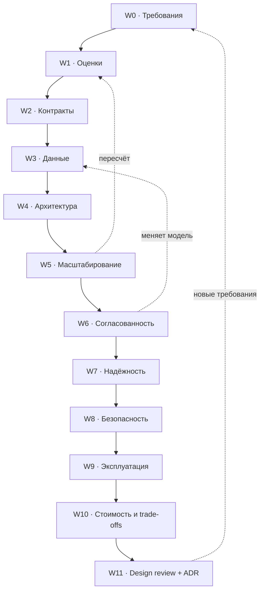

# Workflow: проектирование системы от начала до конца

Двенадцать шагов от «пришла задача» до «дизайн принят». Порядок не ритуальный: каждый шаг производит артефакт, который нужен следующему. Пропуск шага не экономит время — он переносит стоимость ошибки в код.

Документ описывает процесс. Механики (что такое шардинг, как работает Kafka) лежат в карточках `topics/`, ссылки стоят на каждом шаге.



**Итеративность.** Первый проход делается быстро и грубо: W0→W4 за один присест, потом W5→W7 показывают, что оценки или модель данных не сходятся, и вы возвращаетесь. Нормальный дизайн — два-три круга, а не один идеальный проход.

**Быстрый проход (интервью, 45 минут):** W0 (5 мин) → W1 (5) → W2 (5) → W3 (10) → W4 (10) → W5/W6 точечно по узким местам (10). W7–W11 — только упоминанием, если спросят.

---

<a id="w0"></a>

## W0 · Рамки и требования

**Цель.** Понять, что именно строим и по каким числам поймём, что оно работает.

**Вход.** Запрос заказчика, идея, задача с интервью.
**Выход.** Одна страница: сценарии, функциональные требования, нефункциональные требования **с числами**, ограничения, допущения, явный список «вне рамок».

**Вопросы, на которые надо ответить:**
- Кто пользователи, сколько их сейчас и через год?
- Какие 3–5 сценариев критичны? Остальные — вторичны по определению.
- Что дороже: недоступность или рассогласованность данных? (Ответ определит половину дальнейших решений.)
- Какой бюджет задержки у ключевого сценария — с точки зрения пользователя, а не сервера?
- Какая доля чтений к записям? Какой профиль нагрузки — ровный, пиковый, сезонный?
- Что с данными: сколько хранить, можно ли удалять, есть ли требования регуляторов?
- Какие внешние системы обязательны и какие у них ограничения?
- Что явно **не** делаем в этой версии?

**Формулировка NFR.** «Быстро и надёжно» — это не требование. Требование выглядит так:
> Доступность API 99.9 % в месяц (≈ 43 мин простоя). p99 ответа на чтение ленты ≤ 300 мс при 5 000 RPS. Потеря подтверждённой записи недопустима (RPO = 0), восстановление после отказа региона ≤ 30 мин (RTO).

**Типовые ошибки.** Начать с рисования компонентов, не поговорив о требованиях. NFR без чисел. Не зафиксировать «вне рамок» — тогда объём растёт молча.

**Готово, когда.** Каждое NFR имеет число и способ измерения; требования приоритезированы; есть список исключений.

Связано: [T-120 SLI, SLO и бюджет ошибок](topics/10-delivery-and-ops.md#slo) · [T-110 threat modeling](topics/09-security.md#threat-modeling) · [T-049 retention и приватность](topics/03-storage-and-data.md#retention) · [T-138 стоимость как требование](topics/11-performance-and-cost.md#cost) · [T-087 офлайн и ненадёжная сеть](topics/07-architecture-styles.md#client-patterns) · Источники: [Google SRE Book, гл. 4 «Service Level Objectives»](https://sre.google/sre-book/service-level-objectives/), [AWS Well-Architected Framework](https://docs.aws.amazon.com/wellarchitected/latest/framework/welcome.html).

---

<a id="w1"></a>

## W1 · Оценки на салфетке

**Цель.** Понять порядок величин: нужна ли вообще распределённая система, или задача решается одной БД и кэшем.

**Выход.** Табличка чисел: DAU, RPS средний и пиковый, размер записи, объём данных за год, исходящий трафик, бюджет задержки по компонентам.

**Метод.** Сверху вниз, в порядках величин, с явными допущениями:
1. Пользователи → действия на пользователя в день → **средний RPS** = действия / 86 400.
2. **Пиковый RPS** = средний × коэффициент пика (обычно 3–10, для событийных систем — до 100).
3. **Объём** = записей в сутки × размер записи × срок хранения × коэффициент репликации/индексов (×2–3).
4. **Трафик** = RPS × размер ответа. Часто именно он, а не CPU, упирается в деньги.
5. **Бюджет задержки**: разложить целевой p99 по участкам (сеть, gateway, сервис, БД, сериализация) и проверить, что сумма меньше цели.

**Ориентиры для проверки правдоподобия:** одна нода PostgreSQL уверенно держит тысячи простых транзакций в секунду; одна нода Redis — сотни тысяч операций; сеть внутри ЦОД ≈ 0.5 мс, между регионами — десятки миллисекунд; чтение с SSD ≈ 100 мкс, с диска ≈ 10 мс.

**Типовые ошибки.** Считать по среднему и не заложить пик. Забыть про трафик и его стоимость. Считать с точностью до процента там, где неизвестен порядок. Не пересчитать после W5.

**Готово, когда.** Видно узкое место: что упрётся первым — CPU, диск, сеть или деньги.

Связано: [T-128 числа задержек](topics/11-performance-and-cost.md#latency-numbers) · [T-129 перцентили и хвост](topics/11-performance-and-cost.md#percentiles) · [T-134 закон Литтла и насыщение](topics/11-performance-and-cost.md#queueing) · [T-122 ёмкость и автомасштабирование](topics/10-delivery-and-ops.md#capacity) · [T-135 нагрузочное тестирование](topics/11-performance-and-cost.md#load-testing) · [T-138 unit-экономика](topics/11-performance-and-cost.md#cost) · Источники: [Latency Numbers Every Programmer Should Know](https://colin-scott.github.io/personal_website/research/interactive_latency.html), [Gil Tene, How NOT to Measure Latency](https://www.infoq.com/presentations/latency-response-time/).

---

<a id="w2"></a>

## W2 · Контракты и API

**Цель.** Зафиксировать границу между частями системы раньше, чем появится реализация.

**Выход.** Список операций с сигнатурами, выбранный стиль API, схема данных, модель ошибок, правила идемпотентности, пагинации и версионирования.

**Решения этого шага:**
- **Синхронно или асинхронно.** Если операция может занять больше сотен миллисекунд или зависит от третьей стороны — она асинхронная, и в контракте появляется статус операции.
- **Стиль.** REST для ресурсных CRUD-подобных API, gRPC для внутренних вызовов с жёсткими контрактами и стримингом, GraphQL когда клиентов много и им нужны разные срезы.
- **Push или pull.** Нужен ли сервер-инициированный поток: polling, long polling, SSE, WebSocket.
- **Идемпотентность.** Любая небезопасная операция, которую клиент может повторить (а он повторит — по таймауту), нуждается в ключе идемпотентности.
- **Ошибки.** Различать «повторяй» и «не повторяй»: это контракт для ретраев клиента.
- **Совместимость.** Как выкатывать клиент и сервер независимо.

**Типовые ошибки.** Проектировать API от таблиц БД. Возвращать 200 с ошибкой в теле. Пагинация по offset на растущей коллекции. Отсутствие идемпотентности в платёжных и «создающих» операциях.

**Готово, когда.** По контракту можно написать и клиент, и заглушку сервера, не задавая вопросов.

Связано: [T-008 стили API](topics/01-network-and-api.md#api-styles) · [T-055 модели взаимодействия](topics/05-async-and-messaging.md#interaction-models) · [T-012 realtime-транспорт](topics/01-network-and-api.md#realtime) · [T-013 асинхронные операции](topics/01-network-and-api.md#async-operations) · [T-016 идемпотентность](topics/01-network-and-api.md#idempotency) · [T-017 версионирование](topics/01-network-and-api.md#versioning) · [T-018 контракты и схемы](topics/01-network-and-api.md#contracts) · весь блок [B01 · Сеть, протоколы, API](topics/01-network-and-api.md) · Источники: [Stripe API — Idempotent Requests](https://docs.stripe.com/api/idempotent_requests), [Google API Design Guide](https://cloud.google.com/apis/design), [RFC 9110 — HTTP Semantics](https://www.rfc-editor.org/rfc/rfc9110.html).

---

<a id="w3"></a>

## W3 · Данные: модель и хранилище

**Цель.** Выбрать модель и хранилище от того, **как данные читают и пишут**, а не от привычки.

**Выход.** Концептуальная модель, список паттернов доступа, выбор хранилищ с обоснованием, ключи и стратегия роста.

**Порядок действий:**
1. Выписать сущности и связи.
2. Выписать **паттерны доступа**: «получить ленту пользователя за период, 5 000 RPS, p99 200 мс», «найти заказ по номеру», «отчёт за месяц».
3. Для каждого паттерна — какой индекс/ключ его обслуживает.
4. Выбрать хранилище: реляционное по умолчанию; отклонение от умолчания требует обоснования (объём, форма данных, профиль нагрузки).
5. Решить, что будет **источником истины**, а что — производной проекцией (кэш, поисковый индекс, витрина).

**Ключевые развилки.** Нормализация против денормализации (стоимость чтения против стоимости согласованности). Один тип хранилища или несколько (polyglot persistence — это ещё и несколько операционных контуров). Разделение OLTP и OLAP.

**Типовые ошибки.** Выбор БД до формулировки паттернов доступа. Аналитика на боевой базе. Ключ шардирования, выбранный до того, как понятен профиль запросов. Хранение файлов в БД.

**Готово, когда.** Для каждого критичного запроса понятно, какой индекс его закрывает и сколько данных он трогает.

**Решения этого шага.** [D-01 · Выбор хранилища](decisions/D-01-storage-choice.md) — вопросы, оси, дисквалификаторы, рыночный слой. Шаг говорит, *что* решить; документ решения — *как* выбрать и что приложить к ADR.

Связано: [T-031 выбор хранилища](topics/03-storage-and-data.md#storage-choice) · [T-033 моделирование от паттернов доступа](topics/03-storage-and-data.md#data-modeling) · [T-035 индексы](topics/03-storage-and-data.md#indexes) · [T-034 типы данных: деньги и время](topics/03-storage-and-data.md#data-types) · [T-032 специализированные хранилища](topics/03-storage-and-data.md#specialized-stores) · [T-045 OLTP и OLAP](topics/03-storage-and-data.md#oltp-olap) · [T-074 генерация уникальных ID](topics/06-distributed-systems.md#unique-ids) · весь блок [B03 · Хранилища и данные](topics/03-storage-and-data.md) · Источники: [Kleppmann, «Designing Data-Intensive Applications», гл. 2–3](https://dataintensive.net/), [Amazon DynamoDB — Best Practices for Design](https://docs.aws.amazon.com/amazondynamodb/latest/developerguide/best-practices.html).

---

<a id="w4"></a>

## W4 · Верхнеуровневая архитектура

**Цель.** Собрать компоненты и показать, как проходит запрос.

**Выход.** Диаграмма компонентов (C4 уровня «контейнеры») + пошаговый проход 2–3 ключевых сценариев: кто кого вызывает, что пишется, что читается.

**Правила.**
- Компонент появляется в схеме, только если у него есть **зона ответственности** одной фразой. «Сервис обработки» — не зона ответственности.
- Показать поток данных, а не только стрелки: что передаётся и в каком объёме.
- Отметить синхронные и асинхронные границы разными линиями — это будущие точки отказа.
- Сразу отметить, где данные **дублируются** (кэш, индекс, проекция) — это будущие точки рассогласования.

**Типовые ошибки.** Схема из 15 квадратов без потоков. Микросервисы «на будущее» при одной команде и 100 RPS. Отсутствие ответа на вопрос «что произойдёт, если этот квадрат недоступен».

**Готово, когда.** По схеме можно проследить путь ключевого запроса и назвать хранилище истины для каждой сущности.

Связано: [T-021 устройство веб-приложения](topics/01-network-and-api.md#web-app) · [T-076 карта паттернов](topics/06-distributed-systems.md#patterns) · [T-077 монолит и микросервисы](topics/07-architecture-styles.md#monolith-microservices) · [T-078 границы контекстов](topics/07-architecture-styles.md#boundaries) · [T-079 внутренняя архитектура сервиса](topics/07-architecture-styles.md#internal-architecture) · [T-080 хореография и оркестрация](topics/07-architecture-styles.md#event-driven) · [T-056 очередь против лога](topics/05-async-and-messaging.md#queue-vs-log) · [T-024 API Gateway](topics/02-traffic-and-edge.md#api-gateway) · весь блок [B07 · Архитектурные стили](topics/07-architecture-styles.md) · Источники: [C4 model](https://c4model.com/), [arc42](https://arc42.org/).

---

<a id="w5"></a>

## W5 · План масштабирования

**Цель.** Понять, что делать, когда нагрузка вырастет в 10 и в 100 раз — и **не делать этого заранее**.

**Порядок применения (именно в этом порядке):**
1. **Измерить** — найти реальное узкое место, а не предполагаемое.
2. **Вертикально** — увеличить машину. Скучно, но до определённого масштаба дешевле всего.
3. **Кэш** — снять чтения, если профиль читающий.
4. **Реплики чтения** — если кэш не спасает; сразу принять лаг репликации как факт.
5. **Асинхронность** — вынести всё, что не нужно клиенту немедленно, в очередь.
6. **Шардирование** — когда одна нода не держит записи или объём.
7. **Разделение сервисов** — когда причина не в нагрузке, а в организации и цикле релизов.

**Типовые ошибки.** Начать с шардирования. Кэшировать то, что не является узким местом. Считать, что горизонтальное масштабирование бесплатно (оно переносит стоимость в согласованность и эксплуатацию). Не пересчитать оценки W1 после изменений.

**Готово, когда.** Для каждого узкого места есть следующий шаг и известен признак, по которому его пора делать.

Связано: [T-066 вертикально против горизонтально](topics/06-distributed-systems.md#scaling) · [T-050 уровни кэша](topics/04-caching.md#cache-levels) · [T-039 репликация](topics/03-storage-and-data.md#replication) · [T-040 шардирование](topics/03-storage-and-data.md#sharding) · [T-022 балансировка нагрузки](topics/02-traffic-and-edge.md#load-balancing) · [T-133 пулы соединений и N+1](topics/11-performance-and-cost.md#pooling) · [T-132 оптимизация API](topics/11-performance-and-cost.md#api-performance)

---

<a id="w6"></a>

## W6 · Согласованность и корректность

**Цель.** Определить, где нужна строгая согласованность, а где допустима отложенная — и как это не сломается при повторах и гонках.

**Что решается:**
- **Границы транзакций.** Что обязано меняться атомарно. Всё, что не поместилось в одну транзакцию, становится распределённой операцией.
- **Модель согласованности** для каждого чтения: строгая, read-your-writes, causal, eventual. У разных экранов разные требования.
- **Распределённые операции.** Saga (оркестрация или хореография) с компенсациями; transactional outbox для атомарной записи «в БД + в очередь»; 2PC — только когда участники это поддерживают и вы готовы к блокировкам.
- **Идемпотентность и дедупликация.** Ретрай обязан быть безопасным на всех уровнях: клиент → API → консьюмер.
- **Гонки за дефицитным ресурсом** (билет, остаток на складе, уникальный ник): оптимистическая блокировка с версией, уникальный индекс, резервирование с TTL.

**Типовые ошибки.** Считать, что «есть транзакции» = «нет гонок» (read committed допускает write skew). Двойная запись в БД и очередь без outbox. Обещание exactly-once там, где его обеспечивает только дедупликация по ключу.

**Готово, когда.** Для каждой критичной операции описано поведение при: повторе, частичном отказе, параллельном выполнении.

Связано: [T-037 ACID и транзакции](topics/03-storage-and-data.md#acid) · [T-038 уровни изоляции](topics/03-storage-and-data.md#isolation) · [T-068 модели согласованности](topics/06-distributed-systems.md#consistency-models) · [T-073 распределённые транзакции и saga](topics/06-distributed-systems.md#distributed-transactions) · [T-061 transactional outbox](topics/05-async-and-messaging.md#outbox) · [T-060 гарантии доставки](topics/05-async-and-messaging.md#delivery-guarantees) · [T-016 идемпотентность](topics/01-network-and-api.md#idempotency) · весь блок [B06 · Распределённые системы](topics/06-distributed-systems.md) · Источники: [Kleppmann, DDIA, гл. 7 и 9](https://dataintensive.net/), [microservices.io — Saga](https://microservices.io/patterns/data/saga.html), [PostgreSQL — Transaction Isolation](https://www.postgresql.org/docs/current/transaction-iso.html).

---

<a id="w7"></a>

## W7 · Надёжность и деградация

**Цель.** Описать поведение системы при отказах — потому что отказ не гипотеза, а расписание.

**Инструмент — матрица отказов.** Для каждого компонента: что откажет → что увидит пользователь → что делает система → как узнаем.

| Отказ | Последствие | Реакция | Обнаружение |
|---|---|---|---|
| Реплика БД недоступна | Рост задержки чтений | Переключение на другую реплику, чтение с мастера для критичных запросов | Алерт по ошибкам пула |
| Сторонний платёжный шлюз тормозит | Очередь запросов, исчерпание пула | Таймаут 2 с, circuit breaker, очередь на повтор | p99 внешнего вызова |
| Пропала половина подов | Просадка ёмкости | Автоскейлинг, ограничение нагрузки | Readiness-проба, SLO |

**Обязательные механики.** Таймауты на каждом сетевом вызове (без исключений). Ретраи с экспоненциальной задержкой **и джиттером**, ограниченные бюджетом. Circuit breaker перед нестабильными зависимостями. Bulkhead — изоляция пулов, чтобы одна зависимость не съела все потоки. Graceful degradation: что отключаем первым (рекомендации, персонализация) и что защищаем до последнего (оформление заказа).

**Уровень выше.** Multi-AZ по умолчанию; multi-region — только если этого требует SLO, потому что цена высокая. Бэкапы, проверенные восстановлением, RPO и RTO как числа.

**Типовые ошибки.** Ретраи без джиттера и без бюджета (усиливают сбой). Отсутствие таймаута по умолчанию. Health check, проверяющий процесс, но не зависимости — или наоборот, роняющий живые узлы из-за чужой проблемы.

**Готово, когда.** Матрица отказов заполнена, у каждой строки есть реакция и способ обнаружения; известны RPO/RTO.

Связано: [T-095 обзор отказоустойчивости](topics/08-reliability.md#fault-tolerance-overview) · [T-090 таймауты и ретраи](topics/08-reliability.md#timeouts-retries) · [T-091 circuit breaker и bulkhead](topics/08-reliability.md#circuit-breaker) · [T-092 load shedding](topics/08-reliability.md#load-shedding) · [T-093 деградация и фича-флаги](topics/08-reliability.md#degradation) · [T-096 ячеистая архитектура](topics/08-reliability.md#cells) · [T-098 бэкапы, RPO и RTO](topics/08-reliability.md#backup-dr) · [T-071 обнаружение отказов](topics/06-distributed-systems.md#failure-detection) · весь блок [B08 · Надёжность](topics/08-reliability.md) · Источники: [Nygard, «Release It!»](https://pragprog.com/titles/mnee2/release-it-second-edition/), [AWS Builders' Library — Timeouts, retries and backoff with jitter](https://aws.amazon.com/builders-library/timeouts-retries-and-backoff-with-jitter/).

---

<a id="w8"></a>

## W8 · Безопасность

**Цель.** Закрыть аутентификацию, авторизацию, данные и периметр — до того, как система появится в интернете.

**Что описывается:**
- **Аутентификация.** Сессии или токены; для сторонних клиентов — OAuth 2.0 / OIDC. Хранение паролей — только сильный медленный хэш с солью.
- **Авторизация.** Модель прав (RBAC / ABAC / ReBAC) и **место проверки**: в gateway, в сервисе или в запросе к данным. Проверка «на клиенте» проверкой не является.
- **Данные.** Что считается персональными данными, что шифруется в покое и в канале, где ключи, как ротируются, что попадает в логи (и что не должно).
- **Периметр.** Rate limiting, ограничение размера запроса, валидация ввода, CORS, защита от перебора.
- **Секреты.** Хранилище секретов, ротация, отсутствие секретов в репозитории и в переменных окружения контейнера-образа.
- **Аудит.** Кто, что и когда сделал с чувствительными данными.

**Мини-threat-model.** Для каждого входа в систему: кто может обратиться, что подделает, что перехватит, чем перегрузит.

**Типовые ошибки.** Авторизация «по факту наличия токена». Секреты в конфигах. PII в логах и трассировках. Rate limit только на уровне пользователя, но не на уровне IP/ключа.

**Готово, когда.** Для каждой роли и каждого ресурса ясно, кто имеет доступ и где это проверяется.

Связано: [T-100 аутентификация](topics/09-security.md#authentication) · [T-103 авторизация](topics/09-security.md#authorization) · [T-105 безопасность API](topics/09-security.md#api-security) · [T-106 типовые атаки](topics/09-security.md#attacks) · [T-107 шифрование и секреты](topics/09-security.md#encryption) · [T-108 транспортная безопасность](topics/09-security.md#transport-security) · [T-027 rate limiting](topics/02-traffic-and-edge.md#rate-limiting) · [T-110 threat modeling](topics/09-security.md#threat-modeling) · весь блок [B09 · Безопасность](topics/09-security.md) · Источники: [OWASP API Security Top 10](https://owasp.org/API-Security/editions/2023/en/0x11-t10/), [RFC 9700 — OAuth 2.0 Security Best Current Practice](https://www.rfc-editor.org/rfc/rfc9700.html), [NIST SP 800-207 — Zero Trust](https://csrc.nist.gov/pubs/sp/800/207/final).

---

<a id="w9"></a>

## W9 · Наблюдаемость и эксплуатация

**Цель.** Сделать систему диагностируемой и выпускаемой.

**Наблюдаемость.**
- **Метрики.** Для сервисов — RED (Rate, Errors, Duration), для ресурсов — USE (Utilization, Saturation, Errors). Следить за перцентилями, не за средним.
- **Логи.** Структурированные, с идентификатором запроса, без чувствительных данных.
- **Трассировка.** Сквозной trace ID через все сервисы и очереди — иначе распределённый запрос не разобрать.
- **SLI/SLO и error budget.** Алерты по симптомам, видимым пользователю, а не по загрузке CPU.

**Эксплуатация.** Стратегия выката (rolling, blue-green, canary), фича-флаги, план миграций схемы без простоя (expand → migrate → contract), runbook на каждый алерт, постмортемы без поиска виноватых.

**Типовые ошибки.** Алерт на каждую аномалию — дежурный перестаёт их читать. Логи без trace ID. Метрики с высокой кардинальностью, роняющие систему мониторинга. Миграция схемы, требующая одновременного выката кода.

**Готово, когда.** На вопрос «пользователю плохо — где именно?» отвечает дашборд, а не догадка.

Связано: [T-118 observability](topics/10-delivery-and-ops.md#observability) · [T-120 SLI, SLO, бюджет ошибок](topics/10-delivery-and-ops.md#slo) · [T-121 алертинг и дежурства](topics/10-delivery-and-ops.md#alerting) · [T-113 стратегии деплоя](topics/10-delivery-and-ops.md#deploy) · [T-047 миграции без простоя](topics/03-storage-and-data.md#migrations) · [T-123 тестирование](topics/10-delivery-and-ops.md#testing) · [T-114 окружения и тестовые данные](topics/10-delivery-and-ops.md#envs) · [T-124 отладка в проде](topics/10-delivery-and-ops.md#debugging) · весь блок [B10 · Доставка и эксплуатация](topics/10-delivery-and-ops.md) · Источники: [Google SRE Book](https://sre.google/sre-book/table-of-contents/), [OpenTelemetry docs](https://opentelemetry.io/docs/), [Brendan Gregg — USE Method](https://www.brendangregg.com/usemethod.html).

---

<a id="w10"></a>

## W10 · Стоимость и trade-offs

**Цель.** Показать, что вариант выбран осознанно, а не потому, что первым пришёл в голову.

**Выход.** Сравнение 2–3 альтернатив по осям: сложность, задержка, согласованность, стоимость, операционная нагрузка, обратимость решения.

| Ось | Вопрос |
|---|---|
| Сложность | Сколько новых компонентов надо эксплуатировать? |
| Задержка | Что происходит с p99 ключевого сценария? |
| Согласованность | Что пользователь увидит устаревшим и надолго ли? |
| Стоимость | Сколько стоит запрос и сколько — хранение за год? |
| Операции | Кто дежурит и что чинит в 3 часа ночи? |
| Обратимость | Насколько дорого откатить это решение через полгода? |

**Правило.** Необратимые решения (формат хранения, ключ шардирования, публичный контракт) требуют больше анализа, чем обратимые (алгоритм балансировки, размер пула). Обратимые решения принимаются быстро и правятся по данным.

**Типовые ошибки.** Сравнение только по производительности. Игнорирование операционной стоимости нового компонента. Отсутствие оценки «сколько это будет стоить в деньгах».

Связано: [T-138 стоимость и TCO](topics/11-performance-and-cost.md#cost) · [T-119 стоимость наблюдаемости](topics/10-delivery-and-ops.md#observability-cost) · [T-085 serverless: когда выгоден](topics/07-architecture-styles.md#serverless) · [T-116 Kubernetes: чего стоит](topics/10-delivery-and-ops.md#kubernetes) · [T-077 монолит против микросервисов](topics/07-architecture-styles.md#monolith-microservices) · [T-151 разборы реальных архитектур](topics/12-case-studies.md#real-architectures) · Источники: [AWS Well-Architected — Cost Optimization Pillar](https://docs.aws.amazon.com/wellarchitected/latest/cost-optimization-pillar/welcome.html), видео плейлиста [#92](https://www.youtube.com/watch?v=1nENigGr-a0), [#93](https://www.youtube.com/watch?v=2g1G8Jr88xU).

---

<a id="w11"></a>

## W11 · Design review и ADR

**Цель.** Проверить дизайн чужими глазами и записать, **почему** решили так.

### Чек-лист ревью

**Требования**
- [ ] NFR выражены числами и измеримы
- [ ] Явно записано, что вне рамок
- [ ] Профиль нагрузки: пик, а не среднее

**Данные**
- [ ] Для каждого критичного запроса известен обслуживающий индекс
- [ ] Определён источник истины для каждой сущности
- [ ] План роста: что делаем при ×10 и ×100
- [ ] Миграции схемы возможны без простоя

**Корректность**
- [ ] Границы транзакций явные
- [ ] Все небезопасные операции идемпотентны
- [ ] Распределённые операции имеют компенсации
- [ ] Гонки за дефицитным ресурсом разобраны

**Отказы**
- [ ] Таймаут на каждом внешнем вызове
- [ ] Ретраи с джиттером и бюджетом
- [ ] Заполнена матрица отказов
- [ ] Известны RPO и RTO, бэкап проверен восстановлением

**Эксплуатация**
- [ ] SLI/SLO определены, алерты по симптомам
- [ ] Сквозная трассировка
- [ ] Стратегия выката и отката

**Безопасность**
- [ ] Модель авторизации и место проверки
- [ ] Секреты вне кода, PII вне логов
- [ ] Ограничение частоты запросов на периметре

**Стоимость**
- [ ] Оценена стоимость запроса и хранения
- [ ] Сравнены альтернативы, компромисс записан

### Шаблон ADR

```markdown
# ADR-007: Ключ шардирования таблицы заказов

Статус: принято · Дата: 2026-09-02 · Участники: ...

## Контекст
Что происходит, какие числа и ограничения вынуждают принимать решение.

## Варианты
1. Шардирование по user_id — ...
2. Шардирование по order_id (хэш) — ...
3. Не шардировать, вертикальное масштабирование — ...

## Решение
Выбран вариант 1.

## Обоснование
Какие критерии из W10 перевесили.

## Последствия
Что становится дороже, что теряем, при каких условиях решение пересматриваем.
```

Связано: [T-095 обзор отказоустойчивости](topics/08-reliability.md#fault-tolerance-overview) · [T-046 целостность и сверка данных](topics/03-storage-and-data.md#data-integrity) · [T-110 threat modeling](topics/09-security.md#threat-modeling) · [T-120 SLO и бюджет ошибок](topics/10-delivery-and-ops.md#slo) · [T-138 стоимость](topics/11-performance-and-cost.md#cost) · [анти-паттерны](91-antipatterns.md) как второй чек-лист · [числа и матрицы выбора](90-cheatsheets.md)

Источники: [Michael Nygard — Documenting Architecture Decisions](https://cognitect.com/blog/2011/11/15/documenting-architecture-decisions), видео плейлиста [#98 — System Design Interview: Biggest Mistakes to Avoid](https://www.youtube.com/watch?v=OvufRkoD-D0).
