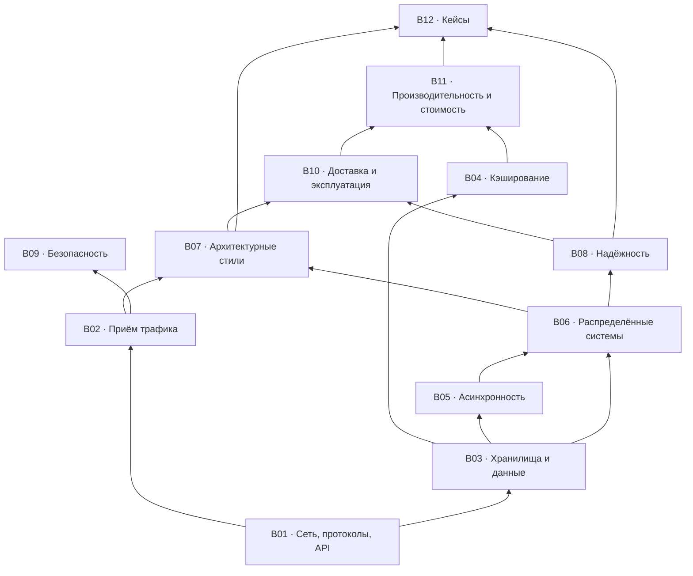

# Roadmap: карта тем

Что и в каком порядке. Блоки связаны зависимостями: тему из верхнего блока обычно нельзя обсуждать, не опираясь на нижние.

**Код карточки состоит из кода темы и номера внутри неё** — `REL-04`, `DATA-11`. Номер внутри блока, а не сквозной: карточку можно добавить, не трогая остальные. Соответствие прежним сквозным номерам — в [`97-card-map.md`](97-card-map.md).

## Три трека прохождения

| Трек | Кому | Что читать |
|---|---|---|
| **Минимум** (~4 часа) | Нужно быстро войти в тему | `00-workflow.md` целиком + NET-01, NET-03, NET-08, NET-16, EDGE-01, EDGE-05, DATA-01, DATA-05, DATA-08, DATA-09, DATA-10, CACHE-01, CACHE-04, MSG-01, MSG-02, MSG-06, DIST-02, DIST-03, DIST-08, REL-01, REL-02, OPS-07, PERF-01 |
| **Полный** | Систематическое изучение | Блоки по порядку графа зависимостей: B01 → B02/B03 → B04/B05 → B06 → B07/B08 → B09/B10/B11 → B12 |
| **Под интервью** | Подготовка к system design интервью | `00-workflow.md` (быстрый проход 45 мин) → B06, B03, B05, B08 → все кейсы B12 → чек-лист W11 |

## Легенда

- 🎬 — тема раскрыта в плейлисте (номера видео → [`93-playlist-map.md`](93-playlist-map.md))
- ➕ — добавлено сверх плейлиста (обоснование → [`94-gaps.md`](94-gaps.md))
- ✅ — карточка написана (все 155 готовы)

## Реестр тем

### B01 · Сеть, протоколы, API

`topics/01-network-and-api.md` · 21 тем

| ID | Статус | Тема | Источник |
|---|---|---|---|
| NET-01 | ✅ | Как работает интернет: DNS, TCP/UDP, маршрутизация | 🎬 #74, #2 |
| NET-02 | ✅ | Сетевая модель OSI и TCP/IP | 🎬 #14 |
| NET-03 | ✅ | HTTP: эволюция 1.1 → 2 → 3 | 🎬 #24, #75 |
| NET-04 | ✅ | HTTPS и TLS: рукопожатие, сертификаты | 🎬 #102 |
| NET-05 | ✅ | HTTP-коды и семантика ошибок | 🎬 #44 |
| NET-06 | ✅ | HTTP-кэширование и условные запросы | ➕ |
| NET-07 | ✅ | Форматы сериализации и сжатие | ➕ |
| NET-08 | ✅ | Стили API: обзор и выбор | 🎬 #29, #91, #63, #94 |
| NET-09 | ✅ | REST: ресурсы, методы, безопасность и идемпотентность методов | 🎬 #4 |
| NET-10 | ✅ | gRPC и protobuf | 🎬 #16 |
| NET-11 | ✅ | GraphQL: когда оправдан | 🎬 #17 |
| NET-12 | ✅ | Realtime-транспорт: polling, long polling, SSE, WebSocket | ➕ |
| NET-13 | ✅ | Асинхронные операции в API: 202 и ресурс статуса | ➕ |
| NET-14 | ✅ | Пагинация: offset vs cursor | 🎬 #83 |
| NET-15 | ✅ | Массовые операции и батчинг | ➕ |
| NET-16 | ✅ | Идемпотентность запросов и ключ идемпотентности | ➕ |
| NET-17 | ✅ | Версионирование API и обратная совместимость | ➕ |
| NET-18 | ✅ | Контракты и схемы: OpenAPI, protobuf, schema registry | ➕ |
| NET-19 | ✅ | CORS и браузерная модель безопасности | ➕ |
| NET-20 | ✅ | API vs SDK | 🎬 #86 |
| NET-21 | ✅ | Устройство веб-приложения (вводная) | 🎬 #80 |

### B02 · Приём трафика: LB / proxy / gateway / CDN

`topics/02-traffic-and-edge.md` · 9 тем

| ID | Статус | Тема | Источник |
|---|---|---|---|
| EDGE-01 | ✅ | Балансировка нагрузки: L4 vs L7, алгоритмы | 🎬 #40, #87 |
| EDGE-02 | ✅ | Proxy и reverse proxy | 🎬 #19 |
| EDGE-03 | ✅ | API Gateway: зона ответственности и отличие от LB/RP | 🎬 #18, #58 |
| EDGE-04 | ✅ | Точка входа: ingress, маршрутизация по путям и версиям | ➕ |
| EDGE-05 | ✅ | CDN и edge-кэширование | 🎬 #15 |
| EDGE-06 | ✅ | Rate limiting: token bucket, leaky bucket, sliding window | ➕ |
| EDGE-07 | ✅ | Защита периметра: WAF, DDoS, боты | ➕ |
| EDGE-08 | ✅ | Service discovery и регистрация сервисов | ➕ |
| EDGE-09 | ✅ | Глобальная маршрутизация: anycast, GSLB, geo-DNS | ➕ |

### B03 · Хранилища и данные

`topics/03-storage-and-data.md` · 19 тем

| ID | Статус | Тема | Источник |
|---|---|---|---|
| DATA-01 | ✅ | Выбор хранилища: SQL, NoSQL, специализированные | 🎬 #1, #68 |
| DATA-02 | ✅ | Специализированные хранилища: time-series, графовые, векторные | ➕ |
| DATA-03 | ✅ | Моделирование данных от паттернов доступа | ➕ |
| DATA-04 | ✅ | Типы данных: деньги, время, часовые пояса, идентификаторы | ➕ |
| DATA-05 | ✅ | Индексы: B-tree vs LSM, составные и покрывающие | 🎬 #5 |
| DATA-06 | ✅ | SQL: порядок выполнения и оптимизация запросов | 🎬 #27 |
| DATA-07 | ✅ | ACID и транзакции | 🎬 #60 |
| DATA-08 | ✅ | Уровни изоляции, аномалии, MVCC, блокировки | ➕ |
| DATA-09 | ✅ | Репликация: sync/async, лаг, read-your-writes | 🎬 #68 |
| DATA-10 | ✅ | Шардирование и партиционирование: выбор ключа, ребалансировка | 🎬 #68 |
| DATA-11 | ✅ | Consistent hashing | ➕ |
| DATA-12 | ✅ | Object storage и работа с файлами | ➕ |
| DATA-13 | ✅ | Полнотекстовый поиск и инвертированный индекс | 🎬 #76 |
| DATA-14 | ✅ | Геоданные и геоиндексы: geohash, S2/H3, R-дерево | ➕ |
| DATA-15 | ✅ | OLTP vs OLAP: warehouse, lake, lakehouse | 🎬 #101, #66 |
| DATA-16 | ✅ | Целостность и сверка данных | ➕ |
| DATA-17 | ✅ | Миграции схемы без простоя, бэкфиллы | ➕ |
| DATA-18 | ✅ | Мультитенантность и изоляция данных | ➕ |
| DATA-19 | ✅ | Retention, удаление данных, приватность | ➕ |

### B04 · Кэширование

`topics/04-caching.md` · 5 тем

| ID | Статус | Тема | Источник |
|---|---|---|---|
| CACHE-01 | ✅ | Уровни кэша: клиент, CDN, приложение, БД | 🎬 #6 |
| CACHE-02 | ✅ | Стратегии: cache-aside, read/write-through, write-behind | 🎬 #6 |
| CACHE-03 | ✅ | Инвалидация и согласованность кэша с БД | 🎬 #57 |
| CACHE-04 | ✅ | Патологии: stampede, hot key, negative caching | 🎬 #57 |
| CACHE-05 | ✅ | Redis: модель данных, однопоточность, сценарии | 🎬 #10, #25, #100 |

### B05 · Асинхронность и обмен сообщениями

`topics/05-async-and-messaging.md` · 11 тем

| ID | Статус | Тема | Источник |
|---|---|---|---|
| MSG-01 | ✅ | Модели взаимодействия: команда, событие, запрос-ответ | ➕ |
| MSG-02 | ✅ | Очередь vs лог: семантика и последствия выбора | 🎬 #67 |
| MSG-03 | ✅ | RabbitMQ и модель AMQP | 🎬 #67 |
| MSG-04 | ✅ | Kafka: устройство, производительность, сценарии | 🎬 #21, #41, #59, #77, #84, #99 |
| MSG-05 | ✅ | Карта брокеров: NATS, Pulsar, SQS/SNS, Redis Streams, БД-как-очередь | ➕ |
| MSG-06 | ✅ | Гарантии доставки и дедупликация | ➕ |
| MSG-07 | ✅ | Transactional outbox и CDC | ➕ |
| MSG-08 | ✅ | Ретраи консьюмера, DLQ, poison messages | ➕ |
| MSG-09 | ✅ | Backpressure и flow control | ➕ |
| MSG-10 | ✅ | Webhooks: доставка, повторы, подпись | 🎬 #56 |
| MSG-11 | ✅ | Data pipeline: батч vs стрим | 🎬 #66 |

### B06 · Распределённые системы и масштабирование

`topics/06-distributed-systems.md` · 11 тем

| ID | Статус | Тема | Источник |
|---|---|---|---|
| DIST-01 | ✅ | Вертикальное vs горизонтальное масштабирование | 🎬 #50, #79 |
| DIST-02 | ✅ | CAP и PACELC | 🎬 #13 |
| DIST-03 | ✅ | Модели согласованности: linearizability, causal, eventual | ➕ |
| DIST-04 | ✅ | Кворумы чтения и записи (R + W > N) | ➕ |
| DIST-05 | ✅ | Консенсус: Raft, leader election | ➕ |
| DIST-06 | ✅ | Обнаружение отказов и мембершип: heartbeat, gossip, SWIM | ➕ |
| DIST-07 | ✅ | Распределённые блокировки и аренда | ➕ |
| DIST-08 | ✅ | Распределённые транзакции: 2PC, saga, TCC | ➕ |
| DIST-09 | ✅ | Генерация уникальных ID: Snowflake, UUIDv7, ULID | ➕ |
| DIST-10 | ✅ | Время, версии, разрешение конфликтов, CRDT | ➕ |
| DIST-11 | ✅ | Паттерны распределённых систем: обзор | 🎬 #26, #65 |

### B07 · Архитектурные стили

`topics/07-architecture-styles.md` · 13 тем

| ID | Статус | Тема | Источник |
|---|---|---|---|
| ARCH-01 | ✅ | Монолит, модульный монолит, микросервисы | 🎬 #20, #32 |
| ARCH-02 | ✅ | Границы сервисов и bounded context | ➕ |
| ARCH-03 | ✅ | Внутренняя архитектура сервиса: слои, порты и адаптеры | ➕ |
| ARCH-04 | ✅ | Event-driven: хореография vs оркестрация | ➕ |
| ARCH-05 | ✅ | Оркестрация длительных процессов: workflow-движки | ➕ |
| ARCH-06 | ✅ | CQRS | ➕ |
| ARCH-07 | ✅ | Event sourcing | ➕ |
| ARCH-08 | ✅ | Фоновые задачи и планировщики | ➕ |
| ARCH-09 | ✅ | Serverless: когда выгоден и когда нет | 🎬 #28 |
| ARCH-10 | ✅ | Service mesh, sidecar, BFF | ➕ |
| ARCH-11 | ✅ | Клиентские архитектурные паттерны | 🎬 #52 |
| ARCH-12 | ✅ | Cloud native | 🎬 #8 |
| ARCH-13 | ✅ | Миграция монолита: strangler fig | ➕ |

### B08 · Надёжность и отказоустойчивость

`topics/08-reliability.md` · 12 тем

| ID | Статус | Тема | Источник |
|---|---|---|---|
| REL-01 | ✅ | Таймауты, ретраи, exponential backoff, jitter | ➕ |
| REL-02 | ✅ | Circuit breaker и bulkhead | ➕ |
| REL-03 | ✅ | Load shedding и приоритизация запросов | ➕ |
| REL-04 | ✅ | Graceful degradation, фича-флаги, kill switch | ➕ |
| REL-05 | ✅ | Health checks: liveness vs readiness | ➕ |
| REL-06 | ✅ | Проектирование отказоустойчивости: обзор | 🎬 #90 |
| REL-07 | ✅ | Ячеистая архитектура и радиус поражения | ➕ |
| REL-08 | ✅ | Multi-AZ, multi-region, failover | ➕ |
| REL-09 | ✅ | Бэкапы, DR, RPO и RTO | ➕ |
| REL-10 | ✅ | Chaos engineering и game days | ➕ |
| REL-11 | ✅ | Метастабильные отказы | ➕ |
| REL-12 | ✅ | Серый отказ и дифференциальная наблюдаемость | ➕ |

### B09 · Безопасность

`topics/09-security.md` · 13 тем

| ID | Статус | Тема | Источник |
|---|---|---|---|
| SEC-01 | ✅ | Аутентификация: сессии vs токены | 🎬 #71 |
| SEC-02 | ✅ | JWT: устройство и грабли | 🎬 #48 |
| SEC-03 | ✅ | OAuth 2.0 и OIDC | 🎬 #33 |
| SEC-04 | ✅ | Авторизация: RBAC, ABAC, ReBAC | ➕ |
| SEC-05 | ✅ | Хранение паролей | 🎬 #22 |
| SEC-06 | ✅ | Безопасность API: типовые угрозы | 🎬 #61 |
| SEC-07 | ✅ | Типовые атаки: XSS, CSRF, SQL-инъекции, SSRF | ➕ |
| SEC-08 | ✅ | Шифрование, управление ключами и секретами | ➕ |
| SEC-09 | ✅ | Транспортная безопасность: TLS, mTLS, SSH | 🎬 #81 |
| SEC-10 | ✅ | Безопасность цепочки поставок и зависимостей | ➕ |
| SEC-11 | ✅ | Threat modeling | ➕ |
| SEC-12 | ✅ | Аудит и трассируемость действий | ➕ |
| SEC-13 | ✅ | Классификация данных и режим защиты | ➕ |

### B10 · Доставка и эксплуатация

`topics/10-delivery-and-ops.md` · 17 тем

| ID | Статус | Тема | Источник |
|---|---|---|---|
| OPS-01 | ✅ | CI/CD | 🎬 #11, #46 |
| OPS-02 | ✅ | Стратегии деплоя: rolling, blue-green, canary | 🎬 #30 |
| OPS-03 | ✅ | Окружения, тестовые данные и стенды | ➕ |
| OPS-04 | ✅ | Bare metal, VM, контейнеры, Docker | 🎬 #23, #43, #88 |
| OPS-05 | ✅ | Kubernetes: что решает и чего стоит | 🎬 #12, #78 |
| OPS-06 | ✅ | Конфигурация и IaC | ➕ |
| OPS-07 | ✅ | Observability: метрики, логи, трейсы | ➕ |
| OPS-08 | ✅ | Стоимость наблюдаемости: кардинальность, сэмплирование, ретенция | ➕ |
| OPS-09 | ✅ | SLI, SLO, error budget | ➕ |
| OPS-10 | ✅ | Алертинг, дежурства, постмортемы | ➕ |
| OPS-11 | ✅ | Ёмкость и автоскейлинг | ➕ |
| OPS-12 | ✅ | Тестирование: пирамида, контрактные, нагрузочные | 🎬 #51 |
| OPS-13 | ✅ | Отладка и диагностика в проде | 🎬 #9 |
| OPS-14 | ✅ | DevOps, SRE, Platform Engineering: роли | 🎬 #36 |
| OPS-15 | ✅ | Монорепозиторий vs полирепо | 🎬 #38 |
| OPS-16 | ✅ | Релиз мобильных приложений | 🎬 #64 |
| OPS-17 | ✅ | Когнитивная нагрузка команды | ➕ |

### B11 · Производительность и стоимость

`topics/11-performance-and-cost.md` · 11 тем

| ID | Статус | Тема | Источник |
|---|---|---|---|
| PERF-01 | ✅ | Числа задержек и бюджет latency | 🎬 #3 |
| PERF-02 | ✅ | Перцентили, tail latency, coordinated omission | ➕ |
| PERF-03 | ✅ | Big-O и структуры данных в инфраструктуре | 🎬 #82, #5 |
| PERF-04 | ✅ | Конкурентность vs параллелизм | 🎬 #69 |
| PERF-05 | ✅ | Оптимизация производительности API | 🎬 #37 |
| PERF-06 | ✅ | Пулы соединений, N+1, батчинг | ➕ |
| PERF-07 | ✅ | Закон Литтла, очереди, насыщение | ➕ |
| PERF-08 | ✅ | Нагрузочное тестирование: методика | ➕ |
| PERF-09 | ✅ | Профилирование и инструменты | 🎬 #73 |
| PERF-10 | ✅ | Сборка мусора и её влияние на p99 | 🎬 #89 |
| PERF-11 | ✅ | Стоимость, TCO, unit-экономика запроса | 🎬 #28 |

### B12 · Кейсы

`topics/12-case-studies.md` · 13 тем

| ID | Статус | Тема | Источник |
|---|---|---|---|
| CASE-01 | ✅ | Сокращатель ссылок (подробный проход) | ➕ |
| CASE-02 | ✅ | Лента новостей (подробный проход) | ➕ |
| CASE-03 | ✅ | Чат / мессенджер (подробный проход) | ➕ |
| CASE-04 | ✅ | Rate limiter | ➕ |
| CASE-05 | ✅ | Сервис уведомлений | ➕ |
| CASE-06 | ✅ | Автодополнение поиска | ➕ |
| CASE-07 | ✅ | Загрузка и раздача видео | ➕ |
| CASE-08 | ✅ | Бронирование билетов: борьба за дефицитный ресурс | ➕ |
| CASE-09 | ✅ | Платёжный поток | ➕ |
| CASE-10 | ✅ | Геопоиск ближайших объектов | ➕ |
| CASE-11 | ✅ | Дедупликация и top-K | ➕ |
| CASE-12 | ✅ | Многотенантный SaaS | ➕ |
| CASE-13 | ✅ | Разборы реальных архитектур: Discord, Netflix, Stack Overflow, Hotstar, Google, Prime Video | 🎬 #31, #34, #32, #54, #95, #28 |

---

**Итого 155 тем:** 65 опираются на видео плейлиста, 90 добавлены сверх него — четыре последние найдены [исследованием поля](research/30-findings.md), а не плейлистом.
Написаны все 151.

Соответствие «видео → тема»: [`93-playlist-map.md`](93-playlist-map.md) · обоснование добавленных тем: [`94-gaps.md`](94-gaps.md) · очередь работ: [`96-backlog.md`](96-backlog.md).
