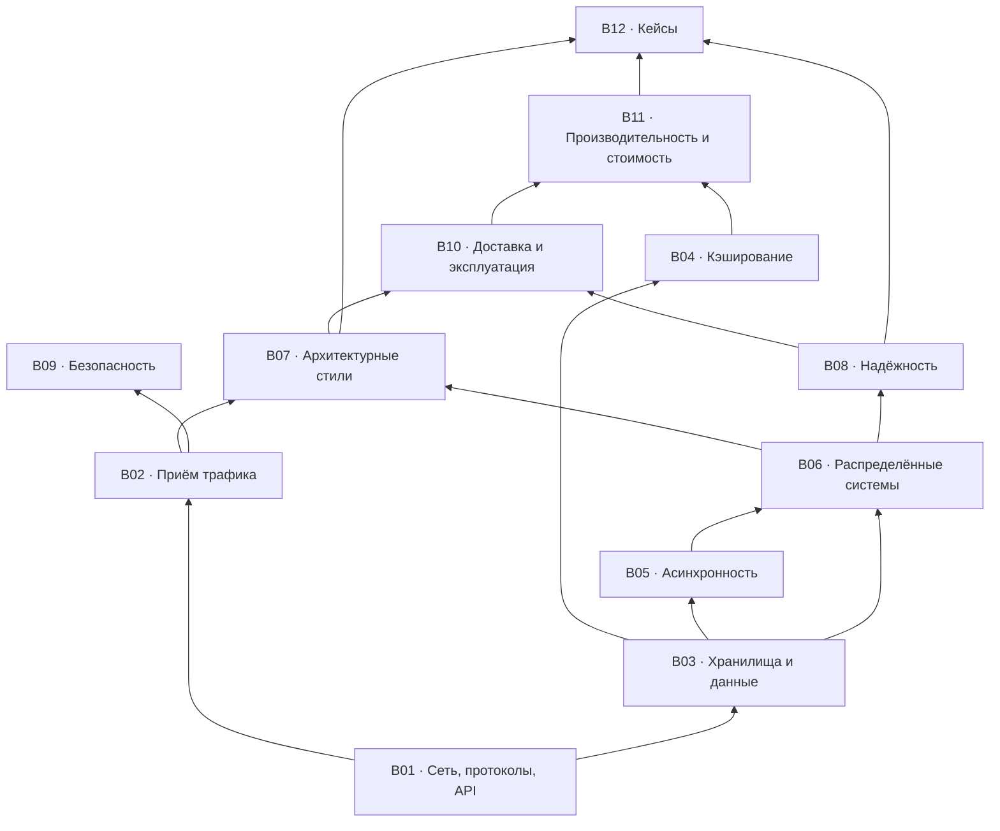

# Roadmap: карта тем

Что и в каком порядке. Блоки связаны зависимостями: тему из верхнего блока обычно нельзя обсуждать, не опираясь на нижние.

## Три трека прохождения

| Трек | Кому | Что читать |
|---|---|---|
| **Минимум** (~4 часа) | Нужно быстро войти в тему | `00-workflow.md` целиком + T-001, T-003, T-008, T-016, T-022, T-026, T-031, T-035, T-038, T-039, T-040, T-050, T-053, T-055, T-056, T-060, T-067, T-068, T-073, T-090, T-091, T-118, T-128 |
| **Полный** | Систематическое изучение | Блоки по порядку графа зависимостей: B01 → B02/B03 → B04/B05 → B06 → B07/B08 → B09/B10/B11 → B12 |
| **Под интервью** | Подготовка к system design интервью | `00-workflow.md` (быстрый проход 45 мин) → B06, B03, B05, B08 → все кейсы B12 → чек-лист W11 |

## Легенда

- 🎬 — тема раскрыта в плейлисте (номера видео → [`93-playlist-map.md`](93-playlist-map.md))
- ➕ — добавлено сверх плейлиста (обоснование → [`94-gaps.md`](94-gaps.md))
- ✅ — карточка написана · ○ — запланирована (очередь работ → [`96-backlog.md`](96-backlog.md))

## Реестр тем

### B01 · Сеть, протоколы, API

`topics/01-network-and-api.md` · 21 тем

| ID | Статус | Тема | Источник |
|---|---|---|---|
| T-001 | ✅ | Как работает интернет: DNS, TCP/UDP, маршрутизация | 🎬 #74, #2 |
| T-002 | ✅ | Сетевая модель OSI и TCP/IP | 🎬 #14 |
| T-003 | ✅ | HTTP: эволюция 1.1 → 2 → 3 | 🎬 #24, #75 |
| T-004 | ✅ | HTTPS и TLS: рукопожатие, сертификаты | 🎬 #102 |
| T-005 | ✅ | HTTP-коды и семантика ошибок | 🎬 #44 |
| T-006 | ✅ | HTTP-кэширование и условные запросы | ➕ |
| T-007 | ✅ | Форматы сериализации и сжатие | ➕ |
| T-008 | ✅ | Стили API: обзор и выбор | 🎬 #29, #91, #63, #94 |
| T-009 | ✅ | REST: ресурсы, методы, безопасность и идемпотентность методов | 🎬 #4 |
| T-010 | ✅ | gRPC и protobuf | 🎬 #16 |
| T-011 | ✅ | GraphQL: когда оправдан | 🎬 #17 |
| T-012 | ✅ | Realtime-транспорт: polling, long polling, SSE, WebSocket | ➕ |
| T-013 | ✅ | Асинхронные операции в API: 202 и ресурс статуса | ➕ |
| T-014 | ✅ | Пагинация: offset vs cursor | 🎬 #83 |
| T-015 | ✅ | Массовые операции и батчинг | ➕ |
| T-016 | ✅ | Идемпотентность запросов и ключ идемпотентности | ➕ |
| T-017 | ✅ | Версионирование API и обратная совместимость | ➕ |
| T-018 | ✅ | Контракты и схемы: OpenAPI, protobuf, schema registry | ➕ |
| T-019 | ✅ | CORS и браузерная модель безопасности | ➕ |
| T-020 | ✅ | API vs SDK | 🎬 #86 |
| T-021 | ✅ | Устройство веб-приложения (вводная) | 🎬 #80 |

### B02 · Приём трафика: LB / proxy / gateway / CDN

`topics/02-traffic-and-edge.md` · 9 тем

| ID | Статус | Тема | Источник |
|---|---|---|---|
| T-022 | ○ | Балансировка нагрузки: L4 vs L7, алгоритмы | 🎬 #40, #87 |
| T-023 | ○ | Proxy и reverse proxy | 🎬 #19 |
| T-024 | ○ | API Gateway: зона ответственности и отличие от LB/RP | 🎬 #18, #58 |
| T-025 | ○ | Точка входа: ingress, маршрутизация по путям и версиям | ➕ |
| T-026 | ○ | CDN и edge-кэширование | 🎬 #15 |
| T-027 | ○ | Rate limiting: token bucket, leaky bucket, sliding window | ➕ |
| T-028 | ○ | Защита периметра: WAF, DDoS, боты | ➕ |
| T-029 | ○ | Service discovery и регистрация сервисов | ➕ |
| T-030 | ○ | Глобальная маршрутизация: anycast, GSLB, geo-DNS | ➕ |

### B03 · Хранилища и данные

`topics/03-storage-and-data.md` · 19 тем

| ID | Статус | Тема | Источник |
|---|---|---|---|
| T-031 | ✅ | Выбор хранилища: SQL, NoSQL, специализированные | 🎬 #1, #68 |
| T-032 | ○ | Специализированные хранилища: time-series, графовые, векторные | ➕ |
| T-033 | ✅ | Моделирование данных от паттернов доступа | ➕ |
| T-034 | ○ | Типы данных: деньги, время, часовые пояса, идентификаторы | ➕ |
| T-035 | ✅ | Индексы: B-tree vs LSM, составные и покрывающие | 🎬 #5 |
| T-036 | ✅ | SQL: порядок выполнения и оптимизация запросов | 🎬 #27 |
| T-037 | ✅ | ACID и транзакции | 🎬 #60 |
| T-038 | ✅ | Уровни изоляции, аномалии, MVCC, блокировки | ➕ |
| T-039 | ✅ | Репликация: sync/async, лаг, read-your-writes | 🎬 #68 |
| T-040 | ✅ | Шардирование и партиционирование: выбор ключа, ребалансировка | 🎬 #68 |
| T-041 | ✅ | Consistent hashing | ➕ |
| T-042 | ✅ | Object storage и работа с файлами | ➕ |
| T-043 | ✅ | Полнотекстовый поиск и инвертированный индекс | 🎬 #76 |
| T-044 | ○ | Геоданные и геоиндексы: geohash, S2/H3, R-дерево | ➕ |
| T-045 | ✅ | OLTP vs OLAP: warehouse, lake, lakehouse | 🎬 #101, #66 |
| T-046 | ○ | Целостность и сверка данных | ➕ |
| T-047 | ✅ | Миграции схемы без простоя, бэкфиллы | ➕ |
| T-048 | ✅ | Мультитенантность и изоляция данных | ➕ |
| T-049 | ✅ | Retention, удаление данных, приватность | ➕ |

### B04 · Кэширование

`topics/04-caching.md` · 5 тем

| ID | Статус | Тема | Источник |
|---|---|---|---|
| T-050 | ✅ | Уровни кэша: клиент, CDN, приложение, БД | 🎬 #6 |
| T-051 | ✅ | Стратегии: cache-aside, read/write-through, write-behind | 🎬 #6 |
| T-052 | ✅ | Инвалидация и согласованность кэша с БД | 🎬 #57 |
| T-053 | ✅ | Патологии: stampede, hot key, negative caching | 🎬 #57 |
| T-054 | ✅ | Redis: модель данных, однопоточность, сценарии | 🎬 #10, #25, #100 |

### B05 · Асинхронность и обмен сообщениями

`topics/05-async-and-messaging.md` · 11 тем

| ID | Статус | Тема | Источник |
|---|---|---|---|
| T-055 | ✅ | Модели взаимодействия: команда, событие, запрос-ответ | ➕ |
| T-056 | ✅ | Очередь vs лог: семантика и последствия выбора | 🎬 #67 |
| T-057 | ✅ | RabbitMQ и модель AMQP | 🎬 #67 |
| T-058 | ✅ | Kafka: устройство, производительность, сценарии | 🎬 #21, #41, #59, #77, #84, #99 |
| T-059 | ✅ | Карта брокеров: NATS, Pulsar, SQS/SNS, Redis Streams, БД-как-очередь | ➕ |
| T-060 | ✅ | Гарантии доставки и дедупликация | ➕ |
| T-061 | ✅ | Transactional outbox и CDC | ➕ |
| T-062 | ✅ | Ретраи консьюмера, DLQ, poison messages | ➕ |
| T-063 | ✅ | Backpressure и flow control | ➕ |
| T-064 | ✅ | Webhooks: доставка, повторы, подпись | 🎬 #56 |
| T-065 | ✅ | Data pipeline: батч vs стрим | 🎬 #66 |

### B06 · Распределённые системы и масштабирование

`topics/06-distributed-systems.md` · 11 тем

| ID | Статус | Тема | Источник |
|---|---|---|---|
| T-066 | ✅ | Вертикальное vs горизонтальное масштабирование | 🎬 #50, #79 |
| T-067 | ✅ | CAP и PACELC | 🎬 #13 |
| T-068 | ✅ | Модели согласованности: linearizability, causal, eventual | ➕ |
| T-069 | ✅ | Кворумы чтения и записи (R + W > N) | ➕ |
| T-070 | ✅ | Консенсус: Raft, leader election | ➕ |
| T-071 | ○ | Обнаружение отказов и мембершип: heartbeat, gossip, SWIM | ➕ |
| T-072 | ✅ | Распределённые блокировки и аренда | ➕ |
| T-073 | ✅ | Распределённые транзакции: 2PC, saga, TCC | ➕ |
| T-074 | ✅ | Генерация уникальных ID: Snowflake, UUIDv7, ULID | ➕ |
| T-075 | ✅ | Время, версии, разрешение конфликтов, CRDT | ➕ |
| T-076 | ✅ | Паттерны распределённых систем: обзор | 🎬 #26, #65 |

### B07 · Архитектурные стили

`topics/07-architecture-styles.md` · 13 тем

| ID | Статус | Тема | Источник |
|---|---|---|---|
| T-077 | ○ | Монолит, модульный монолит, микросервисы | 🎬 #20, #32 |
| T-078 | ○ | Границы сервисов и bounded context | ➕ |
| T-079 | ○ | Внутренняя архитектура сервиса: слои, порты и адаптеры | ➕ |
| T-080 | ○ | Event-driven: хореография vs оркестрация | ➕ |
| T-081 | ○ | Оркестрация длительных процессов: workflow-движки | ➕ |
| T-082 | ○ | CQRS | ➕ |
| T-083 | ○ | Event sourcing | ➕ |
| T-084 | ○ | Фоновые задачи и планировщики | ➕ |
| T-085 | ○ | Serverless: когда выгоден и когда нет | 🎬 #28 |
| T-086 | ○ | Service mesh, sidecar, BFF | ➕ |
| T-087 | ○ | Клиентские архитектурные паттерны | 🎬 #52 |
| T-088 | ○ | Cloud native | 🎬 #8 |
| T-089 | ○ | Миграция монолита: strangler fig | ➕ |

### B08 · Надёжность и отказоустойчивость

`topics/08-reliability.md` · 10 тем

| ID | Статус | Тема | Источник |
|---|---|---|---|
| T-090 | ✅ | Таймауты, ретраи, exponential backoff, jitter | ➕ |
| T-091 | ✅ | Circuit breaker и bulkhead | ➕ |
| T-092 | ○ | Load shedding и приоритизация запросов | ➕ |
| T-093 | ✅ | Graceful degradation, фича-флаги, kill switch | ➕ |
| T-094 | ✅ | Health checks: liveness vs readiness | ➕ |
| T-095 | ✅ | Проектирование отказоустойчивости: обзор | 🎬 #90 |
| T-096 | ○ | Ячеистая архитектура и радиус поражения | ➕ |
| T-097 | ✅ | Multi-AZ, multi-region, failover | ➕ |
| T-098 | ✅ | Бэкапы, DR, RPO и RTO | ➕ |
| T-099 | ✅ | Chaos engineering и game days | ➕ |

### B09 · Безопасность

`topics/09-security.md` · 12 тем

| ID | Статус | Тема | Источник |
|---|---|---|---|
| T-100 | ○ | Аутентификация: сессии vs токены | 🎬 #71 |
| T-101 | ○ | JWT: устройство и грабли | 🎬 #48 |
| T-102 | ○ | OAuth 2.0 и OIDC | 🎬 #33 |
| T-103 | ○ | Авторизация: RBAC, ABAC, ReBAC | ➕ |
| T-104 | ○ | Хранение паролей | 🎬 #22 |
| T-105 | ○ | Безопасность API: типовые угрозы | 🎬 #61 |
| T-106 | ○ | Типовые атаки: XSS, CSRF, SQL-инъекции, SSRF | ➕ |
| T-107 | ○ | Шифрование, управление ключами и секретами | ➕ |
| T-108 | ○ | Транспортная безопасность: TLS, mTLS, SSH | 🎬 #81 |
| T-109 | ○ | Безопасность цепочки поставок и зависимостей | ➕ |
| T-110 | ○ | Threat modeling | ➕ |
| T-111 | ○ | Аудит и трассируемость действий | ➕ |

### B10 · Доставка и эксплуатация

`topics/10-delivery-and-ops.md` · 16 тем

| ID | Статус | Тема | Источник |
|---|---|---|---|
| T-112 | ○ | CI/CD | 🎬 #11, #46 |
| T-113 | ○ | Стратегии деплоя: rolling, blue-green, canary | 🎬 #30 |
| T-114 | ○ | Окружения, тестовые данные и стенды | ➕ |
| T-115 | ○ | Bare metal, VM, контейнеры, Docker | 🎬 #23, #43, #88 |
| T-116 | ○ | Kubernetes: что решает и чего стоит | 🎬 #12, #78 |
| T-117 | ○ | Конфигурация и IaC | ➕ |
| T-118 | ○ | Observability: метрики, логи, трейсы | ➕ |
| T-119 | ○ | Стоимость наблюдаемости: кардинальность, сэмплирование, ретенция | ➕ |
| T-120 | ○ | SLI, SLO, error budget | ➕ |
| T-121 | ○ | Алертинг, дежурства, постмортемы | ➕ |
| T-122 | ○ | Ёмкость и автоскейлинг | ➕ |
| T-123 | ○ | Тестирование: пирамида, контрактные, нагрузочные | 🎬 #51 |
| T-124 | ○ | Отладка и диагностика в проде | 🎬 #9 |
| T-125 | ○ | DevOps, SRE, Platform Engineering: роли | 🎬 #36 |
| T-126 | ○ | Монорепозиторий vs полирепо | 🎬 #38 |
| T-127 | ○ | Релиз мобильных приложений | 🎬 #64 |

### B11 · Производительность и стоимость

`topics/11-performance-and-cost.md` · 11 тем

| ID | Статус | Тема | Источник |
|---|---|---|---|
| T-128 | ○ | Числа задержек и бюджет latency | 🎬 #3 |
| T-129 | ○ | Перцентили, tail latency, coordinated omission | ➕ |
| T-130 | ○ | Big-O и структуры данных в инфраструктуре | 🎬 #82, #5 |
| T-131 | ○ | Конкурентность vs параллелизм | 🎬 #69 |
| T-132 | ○ | Оптимизация производительности API | 🎬 #37 |
| T-133 | ○ | Пулы соединений, N+1, батчинг | ➕ |
| T-134 | ○ | Закон Литтла, очереди, насыщение | ➕ |
| T-135 | ○ | Нагрузочное тестирование: методика | ➕ |
| T-136 | ○ | Профилирование и инструменты | 🎬 #73 |
| T-137 | ○ | Сборка мусора и её влияние на p99 | 🎬 #89 |
| T-138 | ○ | Стоимость, TCO, unit-экономика запроса | 🎬 #28 |

### B12 · Кейсы

`topics/12-case-studies.md` · 13 тем

| ID | Статус | Тема | Источник |
|---|---|---|---|
| T-139 | ○ | Сокращатель ссылок (подробный проход) | ➕ |
| T-140 | ○ | Лента новостей (подробный проход) | ➕ |
| T-141 | ○ | Чат / мессенджер (подробный проход) | ➕ |
| T-142 | ○ | Rate limiter | ➕ |
| T-143 | ○ | Сервис уведомлений | ➕ |
| T-144 | ○ | Автодополнение поиска | ➕ |
| T-145 | ○ | Загрузка и раздача видео | ➕ |
| T-146 | ○ | Бронирование билетов: борьба за дефицитный ресурс | ➕ |
| T-147 | ○ | Платёжный поток | ➕ |
| T-148 | ○ | Геопоиск ближайших объектов | ➕ |
| T-149 | ○ | Дедупликация и top-K | ➕ |
| T-150 | ○ | Многотенантный SaaS | ➕ |
| T-151 | ○ | Разборы реальных архитектур: Discord, Netflix, Stack Overflow, Hotstar, Google, Prime Video | 🎬 #31, #34, #32, #54, #95, #28 |

---

**Итого 151 тем:** 65 опираются на видео плейлиста, 86 добавлены сверх него.
Написано 70, запланировано 81.

Соответствие «видео → тема»: [`93-playlist-map.md`](93-playlist-map.md) · обоснование добавленных тем: [`94-gaps.md`](94-gaps.md) · очередь работ: [`96-backlog.md`](96-backlog.md).
