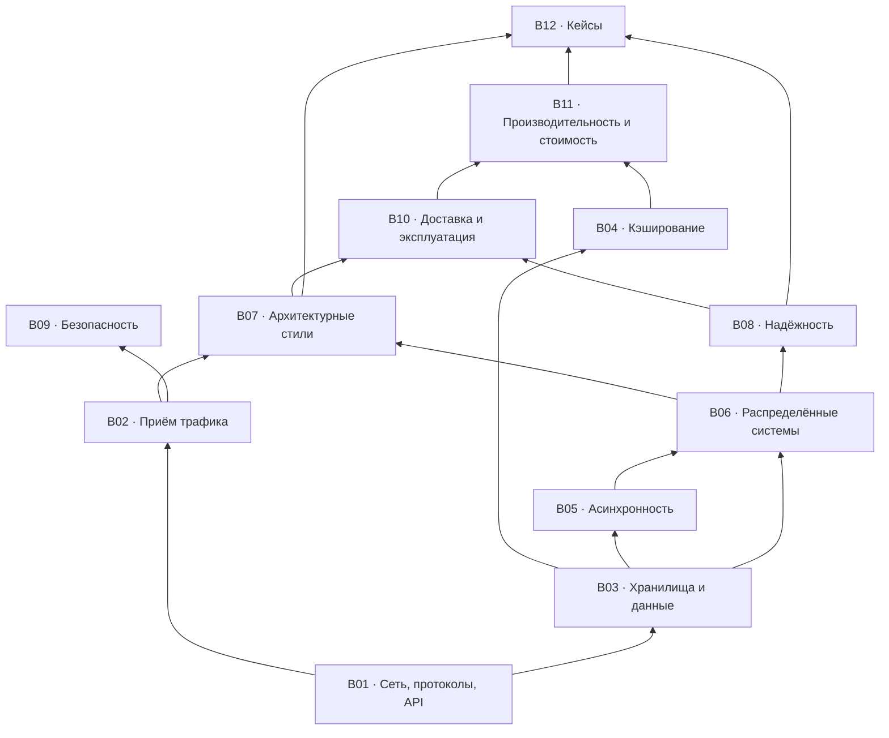

# Roadmap: карта тем

Что и в каком порядке. Блоки связаны зависимостями: тему из верхнего блока обычно нельзя обсуждать, не опираясь на нижние.

## Три трека прохождения

| Трек | Кому | Что читать |
|---|---|---|
| **Минимум** (~4 часа) | Нужно быстро войти в тему | `00-workflow.md` целиком + T-001, T-003, T-006, T-012, T-017, T-020, T-024, T-026, T-029, T-030, T-031, T-039, T-042, T-044, T-046, T-052, T-053, T-058, T-072, T-073, T-095, T-103 |
| **Полный** | Систематическое изучение | Блоки по порядку графа зависимостей: B01 → B02/B03 → B04/B05 → B06 → B07/B08 → B09/B10/B11 → B12 |
| **Под интервью** | Подготовка к system design интервью | `00-workflow.md` (быстрый проход 45 мин) → B06, B03, B05, B08 → все кейсы B12 → чек-лист W11 |

## Легенда

- 🎬 — тема раскрыта в плейлисте (номера видео → [`93-playlist-map.md`](93-playlist-map.md))
- ➕ — добавлено сверх плейлиста (обоснование → [`94-gaps.md`](94-gaps.md))
- 🎬➕ — есть видео, но карточка существенно расширена

## Реестр тем

### B01 · Сеть, протоколы, API

`topics/01-network-and-api.md` · 16 тем

| ID | Тема | Источник |
|---|---|---|
| T-001 | Как работает интернет: DNS, TCP/UDP, маршрутизация | 🎬 #74, #2 |
| T-002 | Сетевая модель OSI и TCP/IP | 🎬 #14 |
| T-003 | HTTP: эволюция 1.1 → 2 → 3 | 🎬 #24, #75 |
| T-004 | HTTPS и TLS: рукопожатие, сертификаты | 🎬 #102 |
| T-005 | HTTP-коды и семантика ошибок | 🎬 #44 |
| T-006 | Стили API: обзор и выбор | 🎬 #29, #91, #63, #94 |
| T-007 | REST: ресурсы, методы, безопасность и идемпотентность методов | 🎬 #4 |
| T-008 | gRPC и protobuf | 🎬 #16 |
| T-009 | GraphQL: когда оправдан | 🎬 #17 |
| T-010 | Realtime-транспорт: polling, long polling, SSE, WebSocket | ➕ |
| T-011 | Пагинация: offset vs cursor | 🎬 #83 |
| T-012 | Идемпотентность запросов и ключ идемпотентности | ➕ |
| T-013 | Версионирование API и обратная совместимость | ➕ |
| T-014 | Контракты и схемы: OpenAPI, protobuf, schema registry | ➕ |
| T-015 | API vs SDK | 🎬 #86 |
| T-016 | Устройство веб-приложения (вводная) | 🎬 #80 |

### B02 · Приём трафика: LB / proxy / gateway / CDN

`topics/02-traffic-and-edge.md` · 7 тем

| ID | Тема | Источник |
|---|---|---|
| T-017 | Балансировка нагрузки: L4 vs L7, алгоритмы | 🎬 #40, #87 |
| T-018 | Proxy и reverse proxy | 🎬 #19 |
| T-019 | API Gateway: зона ответственности и отличие от LB/RP | 🎬 #18, #58 |
| T-020 | CDN и edge-кэширование | 🎬 #15 |
| T-021 | Rate limiting: token bucket, leaky bucket, sliding window | ➕ |
| T-022 | Service discovery и регистрация сервисов | ➕ |
| T-023 | Глобальная маршрутизация: anycast, GSLB, geo-DNS | ➕ |

### B03 · Хранилища и данные

`topics/03-storage-and-data.md` · 15 тем

| ID | Тема | Источник |
|---|---|---|
| T-024 | Выбор хранилища: SQL, NoSQL, специализированные | 🎬 #1, #68 |
| T-025 | Моделирование данных от паттернов доступа | ➕ |
| T-026 | Индексы: B-tree vs LSM, составные и покрывающие | 🎬 #5 |
| T-027 | SQL: порядок выполнения и оптимизация запросов | 🎬 #27 |
| T-028 | ACID и транзакции | 🎬 #60 |
| T-029 | Уровни изоляции, аномалии, MVCC, блокировки | ➕ |
| T-030 | Репликация: sync/async, лаг, read-your-writes | 🎬 #68 |
| T-031 | Шардирование и партиционирование: выбор ключа, ребалансировка | 🎬 #68 |
| T-032 | Consistent hashing | ➕ |
| T-033 | Object storage и работа с файлами | ➕ |
| T-034 | Полнотекстовый поиск и инвертированный индекс | 🎬 #76 |
| T-035 | OLTP vs OLAP: warehouse, lake, lakehouse | 🎬 #101, #66 |
| T-036 | Миграции схемы без простоя, бэкфиллы | ➕ |
| T-037 | Мультитенантность и изоляция данных | ➕ |
| T-038 | Retention, удаление данных, приватность | ➕ |

### B04 · Кэширование

`topics/04-caching.md` · 5 тем

| ID | Тема | Источник |
|---|---|---|
| T-039 | Уровни кэша: клиент, CDN, приложение, БД | 🎬 #6 |
| T-040 | Стратегии: cache-aside, read/write-through, write-behind | 🎬 #6 |
| T-041 | Инвалидация и согласованность кэша с БД | 🎬 #57 |
| T-042 | Патологии: stampede, hot key, negative caching | 🎬 #57 |
| T-043 | Redis: модель данных, однопоточность, сценарии | 🎬 #10, #25, #100 |

### B05 · Асинхронность и обмен сообщениями

`topics/05-async-and-messaging.md` · 8 тем

| ID | Тема | Источник |
|---|---|---|
| T-044 | Очередь vs лог: семантика и последствия выбора | 🎬 #67 |
| T-045 | Kafka: устройство, производительность, сценарии | 🎬 #21, #41, #59, #77, #84, #99 |
| T-046 | Гарантии доставки и дедупликация | ➕ |
| T-047 | Transactional outbox и CDC | ➕ |
| T-048 | Ретраи консьюмера, DLQ, poison messages | ➕ |
| T-049 | Backpressure и flow control | ➕ |
| T-050 | Webhooks: доставка, повторы, подпись | 🎬 #56 |
| T-051 | Data pipeline: батч vs стрим | 🎬 #66 |

### B06 · Распределённые системы и масштабирование

`topics/06-distributed-systems.md` · 10 тем

| ID | Тема | Источник |
|---|---|---|
| T-052 | Вертикальное vs горизонтальное масштабирование | 🎬 #50, #79 |
| T-053 | CAP и PACELC | 🎬 #13 |
| T-054 | Модели согласованности: linearizability, causal, eventual | ➕ |
| T-055 | Кворумы чтения и записи (R + W > N) | ➕ |
| T-056 | Консенсус: Raft, leader election | ➕ |
| T-057 | Распределённые блокировки и аренда | ➕ |
| T-058 | Распределённые транзакции: 2PC, saga, TCC | ➕ |
| T-059 | Генерация уникальных ID: Snowflake, UUIDv7, ULID | ➕ |
| T-060 | Время, версии, разрешение конфликтов, CRDT | ➕ |
| T-061 | Паттерны распределённых систем: обзор | 🎬 #26, #65 |

### B07 · Архитектурные стили

`topics/07-architecture-styles.md` · 10 тем

| ID | Тема | Источник |
|---|---|---|
| T-062 | Монолит, модульный монолит, микросервисы | 🎬 #20, #32 |
| T-063 | Границы сервисов и bounded context | ➕ |
| T-064 | Event-driven: хореография vs оркестрация | ➕ |
| T-065 | CQRS | ➕ |
| T-066 | Event sourcing | ➕ |
| T-067 | Serverless: когда выгоден и когда нет | 🎬 #28 |
| T-068 | Service mesh, sidecar, BFF | ➕ |
| T-069 | Клиентские архитектурные паттерны | 🎬 #52 |
| T-070 | Cloud native | 🎬 #8 |
| T-071 | Миграция монолита: strangler fig | ➕ |

### B08 · Надёжность и отказоустойчивость

`topics/08-reliability.md` · 8 тем

| ID | Тема | Источник |
|---|---|---|
| T-072 | Таймауты, ретраи, exponential backoff, jitter | ➕ |
| T-073 | Circuit breaker и bulkhead | ➕ |
| T-074 | Graceful degradation, фича-флаги, kill switch | ➕ |
| T-075 | Health checks: liveness vs readiness | ➕ |
| T-076 | Проектирование отказоустойчивости: обзор | 🎬 #90 |
| T-077 | Multi-AZ, multi-region, failover | ➕ |
| T-078 | Бэкапы, DR, RPO и RTO | ➕ |
| T-079 | Chaos engineering и game days | ➕ |

### B09 · Безопасность

`topics/09-security.md` · 10 тем

| ID | Тема | Источник |
|---|---|---|
| T-080 | Аутентификация: сессии vs токены | 🎬 #71 |
| T-081 | JWT: устройство и грабли | 🎬 #48 |
| T-082 | OAuth 2.0 и OIDC | 🎬 #33 |
| T-083 | Авторизация: RBAC, ABAC, ReBAC | ➕ |
| T-084 | Хранение паролей | 🎬 #22 |
| T-085 | Безопасность API: типовые угрозы | 🎬 #61 |
| T-086 | Шифрование, управление ключами и секретами | ➕ |
| T-087 | Транспортная безопасность: TLS, mTLS, SSH | 🎬 #81 |
| T-088 | Threat modeling | ➕ |
| T-089 | Аудит и трассируемость действий | ➕ |

### B10 · Доставка и эксплуатация

`topics/10-delivery-and-ops.md` · 13 тем

| ID | Тема | Источник |
|---|---|---|
| T-090 | CI/CD | 🎬 #11, #46 |
| T-091 | Стратегии деплоя: rolling, blue-green, canary | 🎬 #30 |
| T-092 | Bare metal, VM, контейнеры, Docker | 🎬 #23, #43, #88 |
| T-093 | Kubernetes: что решает и чего стоит | 🎬 #12, #78 |
| T-094 | Конфигурация и IaC | ➕ |
| T-095 | Observability: метрики, логи, трейсы | ➕ |
| T-096 | SLI, SLO, error budget | ➕ |
| T-097 | Алертинг, дежурства, постмортемы | ➕ |
| T-098 | Тестирование: пирамида, контрактные, нагрузочные | 🎬 #51 |
| T-099 | Отладка и диагностика в проде | 🎬 #9 |
| T-100 | DevOps, SRE, Platform Engineering: роли | 🎬 #36 |
| T-101 | Монорепозиторий vs полирепо | 🎬 #38 |
| T-102 | Релиз мобильных приложений | 🎬 #64 |

### B11 · Производительность и стоимость

`topics/11-performance-and-cost.md` · 10 тем

| ID | Тема | Источник |
|---|---|---|
| T-103 | Числа задержек и бюджет latency | 🎬 #3 |
| T-104 | Перцентили, tail latency, coordinated omission | ➕ |
| T-105 | Big-O и структуры данных в инфраструктуре | 🎬 #82, #5 |
| T-106 | Конкурентность vs параллелизм | 🎬 #69 |
| T-107 | Оптимизация производительности API | 🎬 #37 |
| T-108 | Пулы соединений, N+1, батчинг | ➕ |
| T-109 | Закон Литтла, очереди, насыщение | ➕ |
| T-110 | Профилирование и инструменты | 🎬 #73 |
| T-111 | Сборка мусора и её влияние на p99 | 🎬 #89 |
| T-112 | Стоимость, TCO, unit-экономика запроса | 🎬 #28 |

### B12 · Кейсы

`topics/12-case-studies.md` · 12 тем

| ID | Тема | Источник |
|---|---|---|
| T-113 | Сокращатель ссылок (подробный проход) | ➕ |
| T-114 | Лента новостей (подробный проход) | ➕ |
| T-115 | Чат / мессенджер (подробный проход) | ➕ |
| T-116 | Rate limiter | ➕ |
| T-117 | Сервис уведомлений | ➕ |
| T-118 | Автодополнение поиска | ➕ |
| T-119 | Загрузка и раздача видео | ➕ |
| T-120 | Бронирование билетов: борьба за дефицитный ресурс | ➕ |
| T-121 | Платёжный поток | ➕ |
| T-122 | Геопоиск ближайших объектов | ➕ |
| T-123 | Дедупликация и top-K | ➕ |
| T-124 | Разборы реальных архитектур: Discord, Netflix, Stack Overflow, Hotstar, Google, Prime Video | 🎬 #31, #34, #32, #54, #95, #28 |

---

**Итого 124 темы:** 64 опираются на видео плейлиста, 60 добавлены сверх него.

Соответствие «видео → тема» в обратную сторону: [`93-playlist-map.md`](93-playlist-map.md). Обоснование добавленных тем: [`94-gaps.md`](94-gaps.md).
